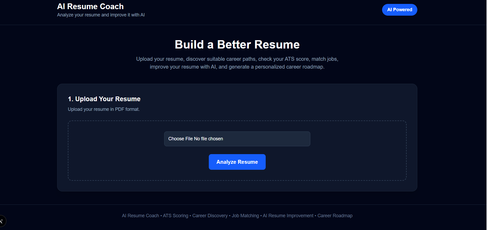
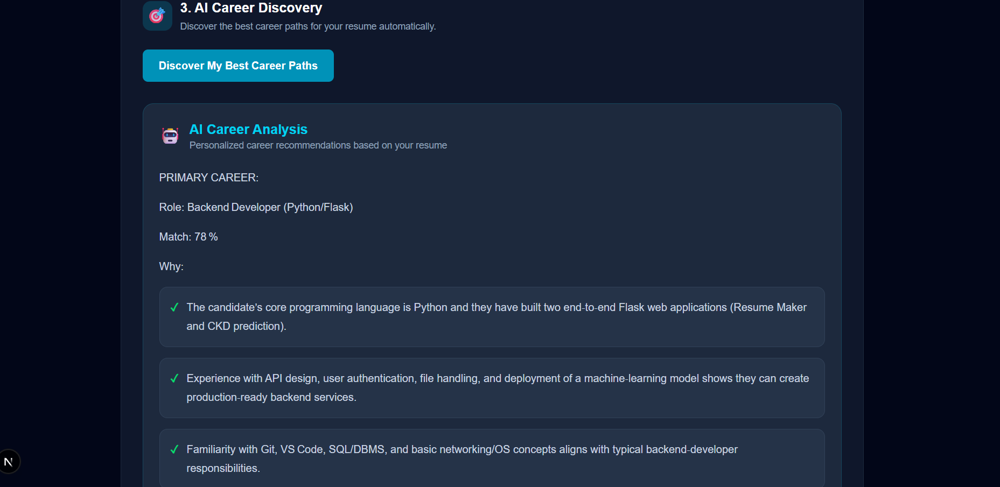

# 🤖 Universal Agentic AI Resume & Career Coach

An AI-powered resume and career coaching platform that analyzes resumes, evaluates ATS readiness, identifies suitable career paths, matches resumes with job descriptions, detects skill gaps, improves resume content, and generates personalized career roadmaps.

## 🖥️ Application Preview

### 🎯 AI Career Discovery

## 🚀 Features

### 📄 Resume Analysis

- Upload a PDF resume
- Extract resume text automatically
- Analyze skills, education, projects, and experience
- Generate an ATS score
- Provide resume improvement suggestions

### 🎯 AI Career Discovery

- Identify suitable career paths
- Provide career match percentages
- Identify missing skills
- Recommend areas for improvement

### 💼 Job Matching

- Match resumes with job descriptions
- Show matched skills
- Show missing skills
- Calculate job match score

### ✍️ AI Resume Coach

- Improve resume content using AI
- Provide professional recommendations

### 🛣️ AI Career Roadmap

- Identify skill gaps
- Generate a personalized learning path
- Recommend projects and skills to develop